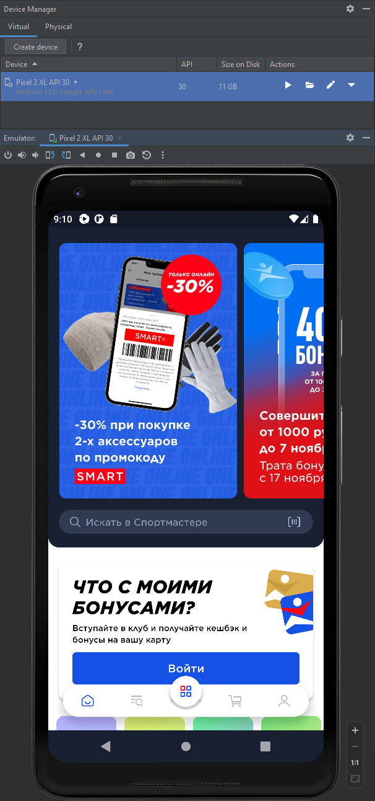
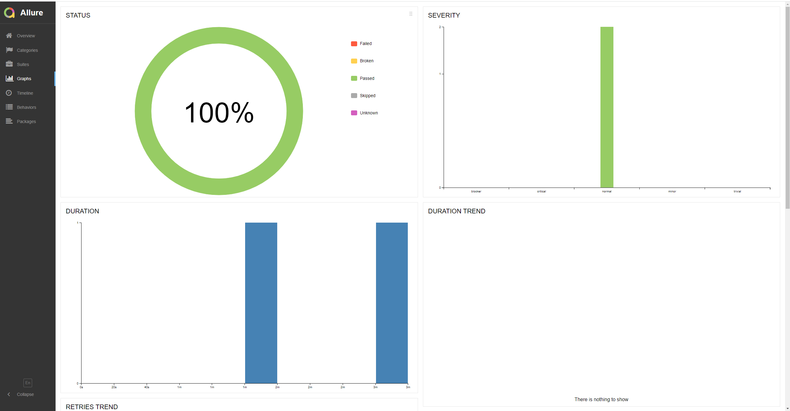
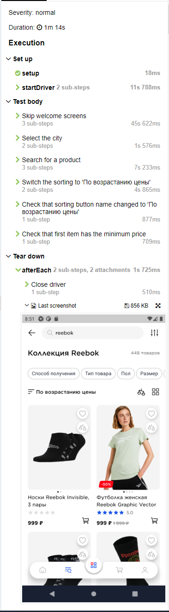

# Тестовое задание
В качестве тестового приложения было выбрано приложение Спортмастер.

 Стек: Java + Selenide + JUnit 5 + Appium + Allure Report:
 - Java 8
 - Selenide 6.5.2
 - Junit 5.8.2
 - Appium 8.0.0
 - Allure 2.17.3

Тест-кейсы содержваться в файле: https://github.com/dubograev/test-task-sc/blob/master/src/test/resources/text-files/test-cases.txt

Для тестов используется эмулятор мобильного девайса - Pixel 2 XL API 30, Android 11, Screen resolution 1920 × 1080 (441 ppi):

После прохождения тестов для получения отчёта необходимо выполнить команду allureServe:

